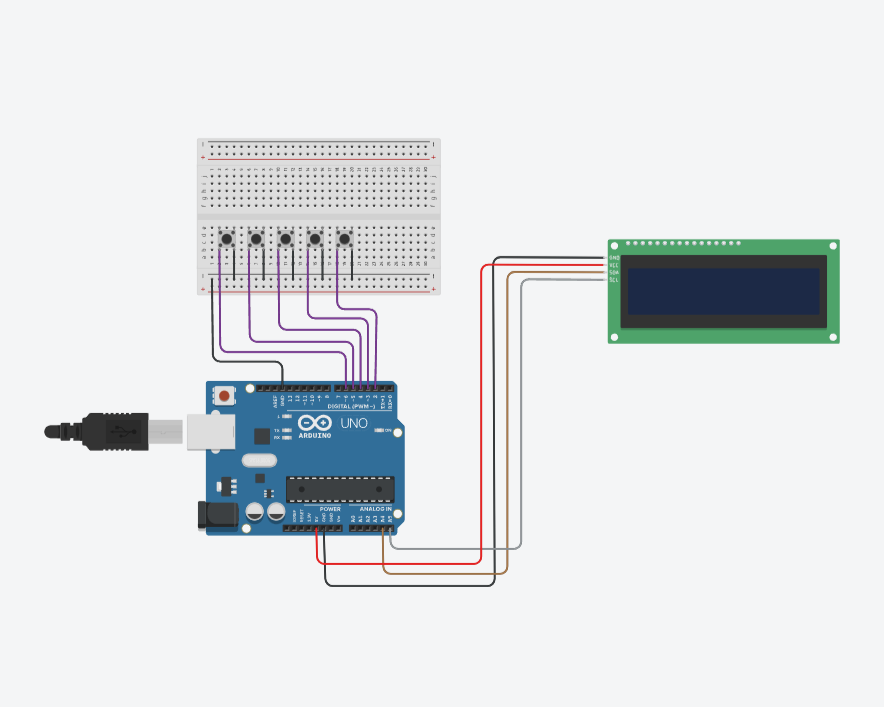
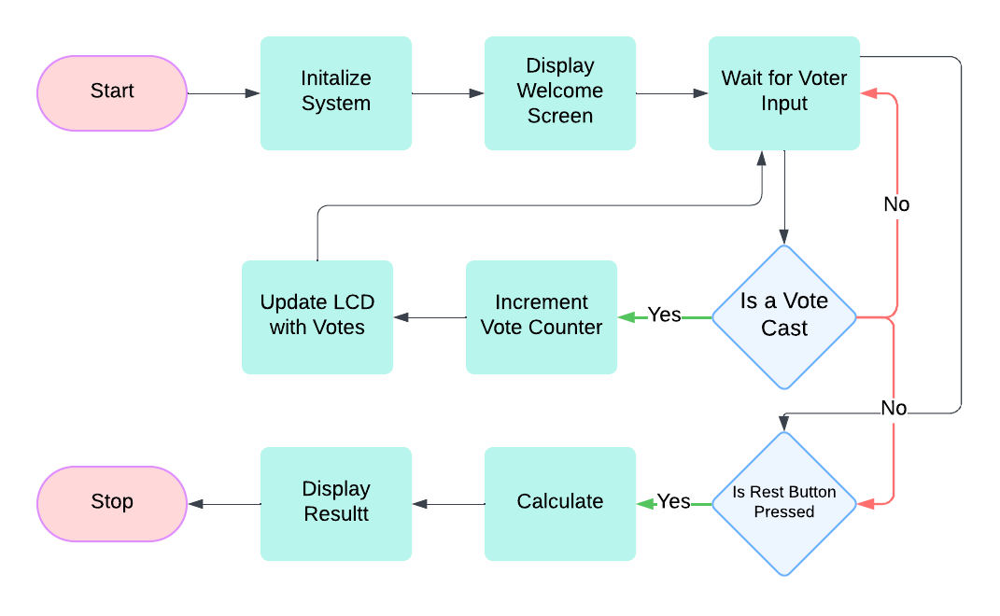
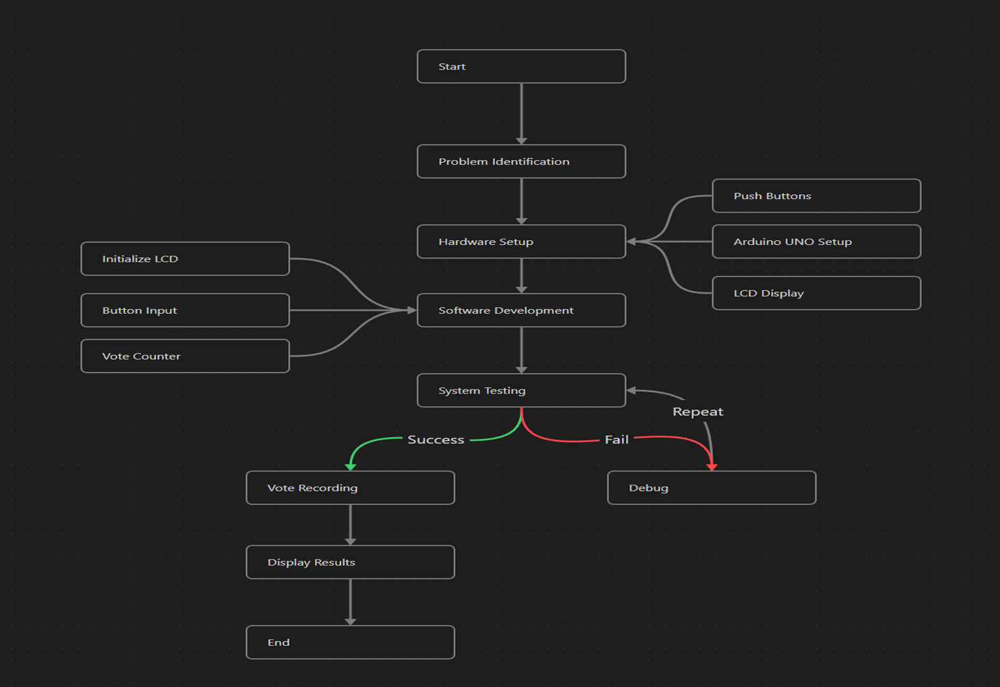

# Electronic Voting Machine (EVM) 🗳️

[](https://www.arduino.cc/)
[](https://isocpp.org/)
[](LICENSE-MIT)
[](LICENSE-GPL)

A secure, efficient, and cost-effective Electronic Voting Machine prototype built with Arduino Uno. This project demonstrates modern voting technology principles while maintaining simplicity and reliability for small-scale elections.

## 📋 Table of Contents

- [Overview](#overview)
- [Features](#features)
- [Hardware Requirements](#hardware-requirements)
- [Software Dependencies](#software-dependencies)
- [Installation & Setup](#installation--setup)
- [Hardware Configuration](#hardware-configuration)
- [Usage](#usage)
- [Project Architecture](#project-architecture)
- [Testing](#testing)
- [Future Enhancements](#future-enhancements)
- [Contributing](#contributing)
- [License](#license)
- [Acknowledgments](#acknowledgments)

## 🎯 Overview

This Electronic Voting Machine prototype simulates a secure and user-friendly electronic voting system designed for educational and demonstration purposes. The system provides real-time vote counting, result display, and tamper-resistant mechanisms using readily available hardware components.

### Key Objectives
- **Security**: Implement vote integrity and prevent tampering
- **Usability**: Provide intuitive user interface with clear feedback
- **Reliability**: Ensure accurate vote counting and result display
- **Cost-Effectiveness**: Utilize affordable components for broad accessibility

## ✨ Features

### Core Functionality
- 🗳️ **Multi-Candidate Voting**: Support for up to four voting categories/candidates
- 📊 **Real-Time Counting**: Live vote count display during voting process
- 🖥️ **LCD Display**: Clear visual feedback and result presentation
- 💡 **LED Indicators**: Visual confirmation of vote registration
- 🔒 **Tamper Resistance**: Basic security measures to prevent unauthorized access
- ⚡ **Instant Results**: Immediate result calculation and display

### Technical Features
- Debounced button inputs for reliable vote registration
- Memory-efficient vote storage
- Clean and maintainable C++ codebase
- Modular design for easy customization

## 🔧 Hardware Requirements

| Component | Quantity | Purpose |
|-----------|----------|---------|
| Arduino Uno R3 | 1 | Main microcontroller |
| 16x2 LCD Display (I2C) | 1 | Vote display and results |
| Push Buttons | 4+ | Voter input interface |
| LEDs | 4+ | Visual feedback indicators |
| Resistors (220Ω) | 4+ | LED current limiting |
| Pull-up Resistors (10kΩ) | 4+ | Button debouncing |
| Breadboard/PCB | 1 | Circuit assembly |
| Jumper Wires | Various | Connections |
| Power Supply | 1 | 5V DC power source |

## 💻 Software Dependencies

- **Arduino IDE** (v1.8.0 or higher)
- **LiquidCrystal_I2C Library** (v1.1.2 or higher)
- **C++ Compiler** (included with Arduino IDE)

## 🚀 Installation & Setup

### 1. Environment Setup
```bash
# Download and install Arduino IDE from https://arduino.cc/downloads
# Clone this repository
git clone https://github.com/Mohammed-051/Electronic-Voting-Machine.git
cd Electronic-Voting-Machine
```

### 2. Library Installation
1. Open Arduino IDE
2. Navigate to **Sketch** > **Include Library** > **Add .ZIP Library**
3. Select `libs/LiquidCrystal_I2C-1.1.2.zip`
4. Verify installation in **Sketch** > **Include Library**

### 3. Hardware Assembly
1. Follow the circuit diagram below for proper connections
2. Ensure all components are securely connected
3. Double-check power connections (5V and GND)

### 4. Code Upload
1. Open `src/EVM_Code.ino` in Arduino IDE
2. Select **Board**: Arduino Uno
3. Select appropriate **Port**
4. Click **Upload** button

## 🔌 Hardware Configuration

### Circuit Diagram


### Pin Configuration
| Arduino Pin | Component | Function |
|-------------|-----------|----------|
| A4 (SDA) | LCD SDA | I2C Data |
| A5 (SCL) | LCD SCL | I2C Clock |
| D2-D5 | Push Buttons | Vote Input |
| D6-D9 | LEDs | Status Indicators |
| 5V | VCC | Power Supply |
| GND | Ground | Common Ground |

## 📖 Usage

### Operating Procedure
1. **Power On**: Connect power supply to Arduino
2. **Initialization**: LCD displays welcome message
3. **Voting Phase**: 
   - Press candidate buttons to cast votes
   - LED feedback confirms each vote
   - LCD shows real-time vote counts
4. **Results**: Final vote tally displayed on LCD
5. **Reset**: Power cycle to restart voting process

### User Interface
- **Button 1-4**: Vote for respective candidates
- **LCD Line 1**: Current voting status
- **LCD Line 2**: Live vote counts
- **LEDs**: Vote confirmation indicators

## 🏗️ Project Architecture

### System Flow


### Workflow Process


### Software Architecture
```
src/
├── EVM_Code.ino          # Main application code
├── vote_handler.cpp      # Vote processing logic
├── display_manager.cpp   # LCD display functions
└── security.cpp          # Security mechanisms
```

## 🧪 Testing

### Unit Testing
- **Button Response**: Verify each button registers correctly
- **LCD Display**: Confirm proper text rendering
- **Vote Counting**: Validate accurate vote tallying
- **LED Indicators**: Test visual feedback system

### Integration Testing
- **Complete Voting Cycle**: End-to-end system testing
- **Edge Cases**: Multiple rapid button presses, simultaneous inputs
- **Power Cycle**: System behavior after restart
- **Data Integrity**: Vote count accuracy under various conditions

### Test Checklist
- [ ] All buttons respond to input
- [ ] LCD displays correct information
- [ ] Vote counts increment accurately
- [ ] LEDs provide proper feedback
- [ ] Results display correctly
- [ ] System handles edge cases gracefully

## 🚀 Future Enhancements

### Short-term Goals
- [ ] **Enhanced Security**: Implement encryption for vote data
- [ ] **User Authentication**: Add RFID/fingerprint voter verification
- [ ] **Data Logging**: Store voting history with timestamps
- [ ] **Network Connectivity**: WiFi module for remote monitoring

### Long-term Vision
- [ ] **Blockchain Integration**: Immutable vote storage
- [ ] **Mobile App**: Remote monitoring and administration
- [ ] **Scalability**: Support for larger elections
- [ ] **Advanced Analytics**: Voting pattern analysis
- [ ] **Multi-language Support**: Internationalization features

## 🤝 Contributing

We welcome contributions from the community! Please follow these guidelines:

### How to Contribute
1. **Fork** the repository
2. **Create** a feature branch (`git checkout -b feature/amazing-feature`)
3. **Commit** your changes (`git commit -m 'Add amazing feature'`)
4. **Push** to the branch (`git push origin feature/amazing-feature`)
5. **Open** a Pull Request

### Development Guidelines
- Follow Arduino coding standards
- Add comments for complex logic
- Test thoroughly before submitting
- Update documentation as needed

### Issues and Bug Reports
- Use the issue tracker for bug reports
- Provide detailed reproduction steps
- Include hardware configuration details

## 📄 License

This project is dual-licensed under:
- [MIT License](LICENSE-MIT) - For educational and commercial use
- [GPL v3 License](LICENSE-GPL) - For open-source compliance

Choose the license that best fits your use case.

## 🙏 Acknowledgments

### Team Credits
This project was developed as a collaborative group effort by dedicated team members who contributed their expertise in hardware design, software development, and system testing.

### Special Thanks
- Arduino Community for comprehensive documentation
- Open-source contributors for libraries and tools
- Educational institutions supporting embedded systems research

### References
- Arduino Official Documentation
- Embedded Systems Design Principles
- Electronic Voting System Standards

---

**⚠️ Disclaimer**: This is an educational prototype designed for learning purposes. For production voting systems, additional security measures, certifications, and compliance with electoral regulations are required.

**📞 Support**: For questions or support, please open an issue in the GitHub repository.

**🌟 Star this repository** if you found it helpful!