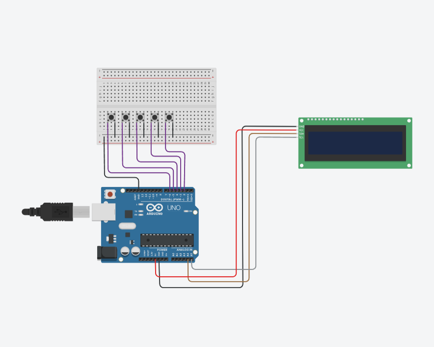

# Electronic-Voting-Machine
A secure and efficient Electronic Voting Machine (EVM) prototype, developed using Arduino Uno, LCDs, and buttons. Includes project report, diagrams, and code.
## Overview:
This project simulates a secure and user-friendly electronic voting system. Developed using Arduino, it features real-time vote counting, result display on an LCD, and tamper-resistant mechanisms.

## Features:
- Real-time vote counting for up to four categories.
- Dynamic result display on an LCD.
- Visual feedback using LEDs.
- Cost-effective design for small-scale elections.

## Technologies Used:
- Arduino
- C++
- LiquidCrystal_I2C library

## Setup Instructions:
1. Connect Arduino Uno to the circuit as per the circuit diagram.
2. Upload the code (`src/EVM_Code.ino`) using the Arduino IDE.
3. Ensure all buttons and LEDs are functioning before running tests.

## Future Work:
- Integration of biometric authentication.
- Blockchain-based vote storage for scalability.

## Work Flow 

## Hardware Setup

## Licenses
- [MIT License](LICENSE-MIT)
- [GPL v3 License](LICENSE-GPL)

